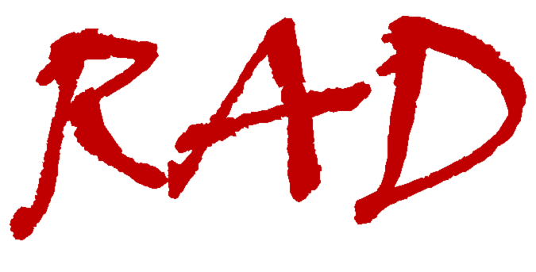

<div align="center">

[](#readme)

</div>

# radT

<!-- [](https://pypi.python.org/pypi/moderngl) [](https://anaconda.org/conda-forge/moderngl/)  [](https://moderngl.readthedocs.io) -->

radT (Resource Aware Data science Tracker) is an extension to MLFlow that simplifies the collection and exploration of hardware metrics of machine learning and deep learning applications. Usually, collecting and processing all the required metrics for these workloads is a hassle. In contrast, RADT is easy to deploy and use, with minimal impact on both performance and time investment. The codebase of RADT is documented and easily expandable.

This work has been published at the SIGMOD workshop DEEM 2023: https://itu-dasyalab.github.io/RAD/publication/papers/DEEM2023.pdf

```sh
pip install radt
```

<!-- - [Documentation](https://radt.readthedocs.io/) -->
- [Examples](https://github.com/Resource-Aware-Data-systems-RAD/radt/tree/master/examples/#readme)
- [radT on Github](https://github.com/Resource-Aware-Data-Systems-RAD/radt)
- [radT on PyPI](https://pypi.org/project/radt/)

## Features

- Wide configuration support including collocation
- Track hardware and software metrics
- Handle continuous streams of data
- Support multiple visualization use-cases
- Filter large amounts of inconsequential data
- Minimal code impact

## Sample usage & getting started

Replace `python` in your training script by `radt`, e.g.:

```py
>>> radt train.py --batch-size 256
```

or, when using virtual environments/conda:

```py
>>> python -m radt train.py --batch-size 256
```

For a complete getting started guide and examples please visit the [Examples](https://github.com/Resource-Aware-Data-systems-RAD/radt/tree/master/examples/#readme).

## Easy to use via automated tracking

radT will automatically track hardware metrics for your application. The listeners will start tracking your application on invocation.

As radT extends MLFlow, you can either use the advanced tracking or use MLFlow to track software metrics (e.g. loss).

## Advanced tracking options via context

If you want to have more control over what is logged, you can encapsulate your training loop in the RADT context:

```py
from radtrun import RADT

with RADT as run:
  # training loop
```

## CSV syntax for larger experiments

RADT can take the hassle of large experiments off you by training multiple models in succession. Models can even be trained at the same time on different gpus or at the same gpu using a range of collocation schemes.

```csv
Experiment,Workload,Status,Run,Devices,Collocation,File,Listeners,Params
2,21,,,0,-,../pytorch/cifar10.py,smi+top+dcgmi,batch-size=128
2,21,,,1,-,../pytorch/cifar10.py,smi+top+dcgmi,batch-size=128

```

When interrupted by any means, a csv experiment can be rescheduled to continue from where it left off.

## Supported platforms

- [x] Linux

<!-- 
## Citation

If you need to cite this repository in academic research:
```txt
@Online{
}
``` -->


## Contributors

- [Ties Robroek](https://github.com/sipondo)
- [Aaron Duane](https://github.com/aaduane/)
- [Ehsan Yousefzadeh-Asl-Miandoab](https://github.com/ehsanyousefzadehasl)
- [Pınar Tözün](https://github.com/ptozun)

Thank You!

Contributions are welcome. _(Please add yourself to the list)_
